# 自定义文件关联(CFA)

## 基本语法

该功能在在QuickStart/ReadMe.md已经讲过了。例如，Windows文件管理器中，默认TXT文本是使用记事本打开的，如果需要修改默认调用程序，需要在Windows10设置中按照文件类型选择默认应用程序。同样地，CFA是用于XY中，用于关联双击某个格式的文件时，默认调用指定应用程序。

指定格式对应调用的应用规则：

```
格式名1;格式名2;...;格式名N>应用程序路径
```

例如

```
txt><xydrive>\PortableApps\1-Editor\Notepad2\Notepad2.exe
```

打开.txt文件，默认调用Notepad2.exe。


# 便携式打开方式菜单(POM)

在Windows文件管理器空白处或文件进行右键，弹出的右键菜单项都是固定不变的，如果想要增删改这些菜单项，都需要通过注册表。而在XY中，右键空白处的菜单项一般是不可改变的，只有对文件进行右键弹出的菜单项是可以改变的。

## POM使用前提

针对同一种文件格式，可能需要调用不同的应用程序，例如，看图片用HoneyView，对图片进行格式转化，你可能需要使用XnView，使用POM可以达到使用不同应用程序打开同种格式的文件。想要使用POM，需要让同一种文件格式关联不同应用程序，这就需要设置CFA。

在CFA中添加关联规则。才可有效使用本功能。


## 打开方式(Open With...)

### 背景引入

如下图，选中目标文件<kbd>Ctrl + Alt + Enter</kbd>，会弹出如下PopUp菜单：


上图就是便携式打开方式菜单的"打开方式"。可以看到这个"打开方式"菜单有三个视频播放，这是如何设置的呢？

我在自定义文件管理设置了三个视频播放器，并勾选：

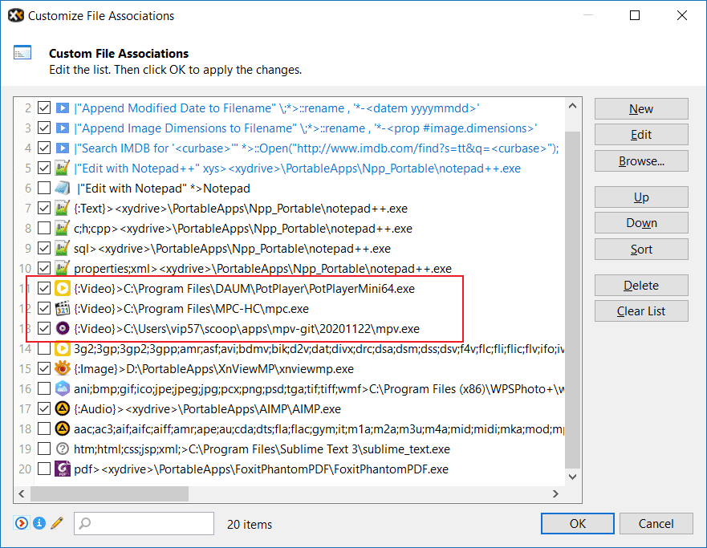

按顺序，如果直接双击打开，默认是最上面的Potplayer。如果要使用其他视频播放器打开，就可以用到"打开方式"这个功能，刚才讲过，通过<kbd>Ctrl + Alt + Enter</kbd>就可以调用这个功能。

### 介绍

对比Windows右键打开方式，它虽然可以关联和设置某个格式的应用，但是依托宿主系统，不具备便携式。我们将的这个"打开方式"是属于`Portable OpenWith Menu(POM)`中的功能。通过<kbd>Ctrl + Alt + Enter</kbd>就可以调用POM中的"Open With..."(打开方式)。POM是可配置的，可便携式，这便是它的优点。

对同类格式文件需要用到不同应用软件,通过配置POM以满足不同的打开需求。

[案例]：比如对于.c和.h文件来说，有时我想要用notepad打开，有时想用VS Code打开，有时想用Dev-C++打开，通过将格式规则写到"自定义文件关联"就可以了。

对比Windows文件管理器，它的右键打开就显得繁琐。

基于这样的需求，我修改了我的"自定义文件关联"：

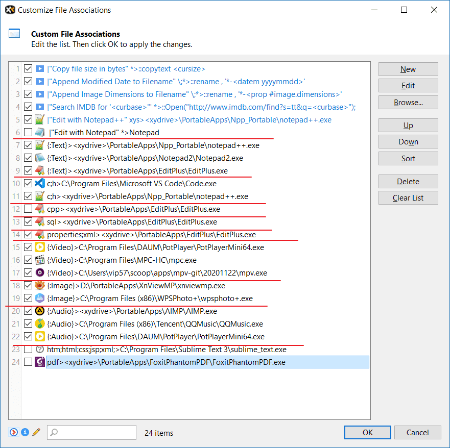


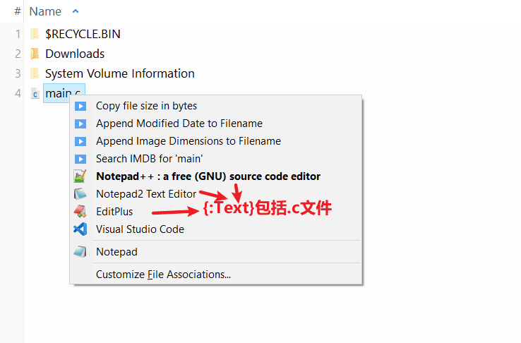


这是官网关于POM的介绍：[XYplorer - Tour - Portable Openwith Menu™](https://www.xyplorer.com/tour.php?page=pom)

# 通用文件类型(Generic File Type)

## 介绍

什么是通用文件类型？

例如`{:Image}`可以表示为有限个图片格式的集合，其图片格式包含

```
*.gif;*.ico;*.cur;*.emf;*.wmf;*.png;*.bmp;*.dib;*.rle;*.tga;*.tpic;*.dds;*.hdr;*.pic;*.pict;*.clip;*.lip;*.exr;*.heic;*.heif;*.webp;*.afphoto;*.jfif;*.jpg;*.jpeg;*.jpe;*.psb;*.psd;*.arw;*.cpt;*.cr2;*.crw;*.dcr;*.dng;*.erf;*.fff;*.mrw;*.mef;*.nef;*.nrw;*.orf;*.pef;*.raf;*.raw;*.rw2;*.rwl;*.sr2;*.srf;*.srw;*.x3f;*.tif;*.tiff
```


有哪些Generic File Type呢？

```
 {:Text}       *
 {:Image}      *
 {:Photo}      *   = All image formats that may contain Exif data.
 {:Audio}      *
 {:Video}      *
 {:Media}      *   = Audio & Video
 {:Font}       *
 {:Vector}
 {:Web}        *
 {:Office}     *
 {:Archive}
 {:Executable}
```


通用文件类型用于何处？

这些通用文件类型用于CFA关联规则中。


想参考关于Generic File Type，请在地址栏输入：

```
rtfm "idh_visualfilters.htm#idh_genericfiletypes";
```


## 如何打印 某个Generic File Type呢

如何查看Generic File Type类型的所有格式呢？菜单栏"脚本(Scripting)->运行脚本(Run Script...)"，输入如下内容：(这里我们就查看下{:Photo}的所有格式)

```
 echo get("genericfiletype", "{:Photo}", ";");
```


## 排除某个格式会被Generic File Type引入

过度使用Generic File Type虽然节省键入代表格式的字符的书写空间以及保持自定义文件关联规则的整洁，但也带来了把一些用户不想被关联的格式引入进来的问题。

比如我的markdown文件(.md)双击按理应该调用系统默认应用(我的是Typora)，但是实际调用的是Notepad++，于是<kbd>Ctrl+Alt+Enter</kbd>调用了"打开方式":

对于格式的系统默认应用，可以按如图所示辨别出来,

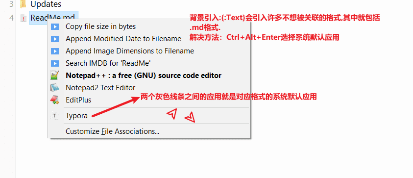

要使用快捷键调用"打开方式"确实没双击应用调用默认应用来得快，这也是引入Generic File Type的弊端。好消息这一弊端可以修正的。

我们可以指定某个格式不被Generic File Type引入，它的解决方法就是：使用`#`(The special variable #)。

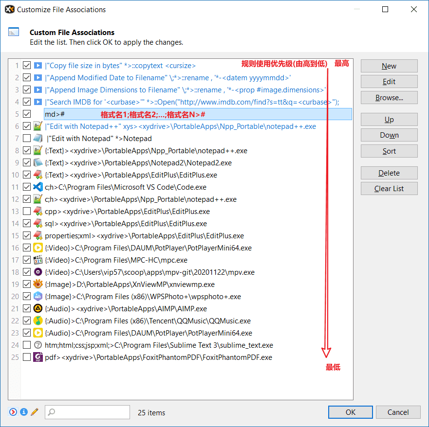

语法格式：

```
格式名1;格式名2;...;格式名N>#
```

注意这条语句的优先级应该设置为最高，放在最下面就根本不会使用到。比如调用.md格式的文件，先走`md>#`这条规则然后就调用.md格式的系统默认应用。若`md>#`放在所有规则的最下面，那么它就会走{:Text}规则，那么就会调用第一个"{:Text}>\<xydrive\>\PortableApps\Npp_Portable\notepad++.exe"规则，根本不会执行到`md>#`这条规则。


# CFA使用案例

CFA使用案例: 无需POM,使用Script定制CFA

友情提示：这部分需要掌握Scripting哦。

CFA中使用Scripting的示意图(以Batch文件为例)：

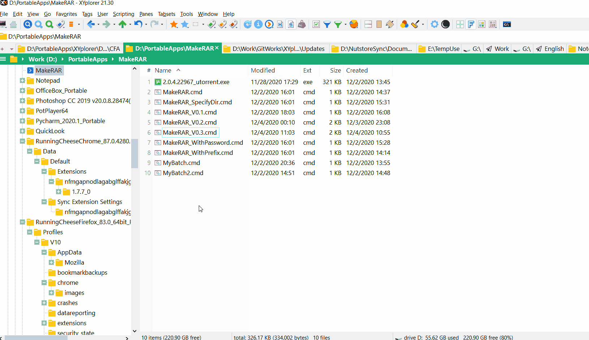

与下面POM进行比较：

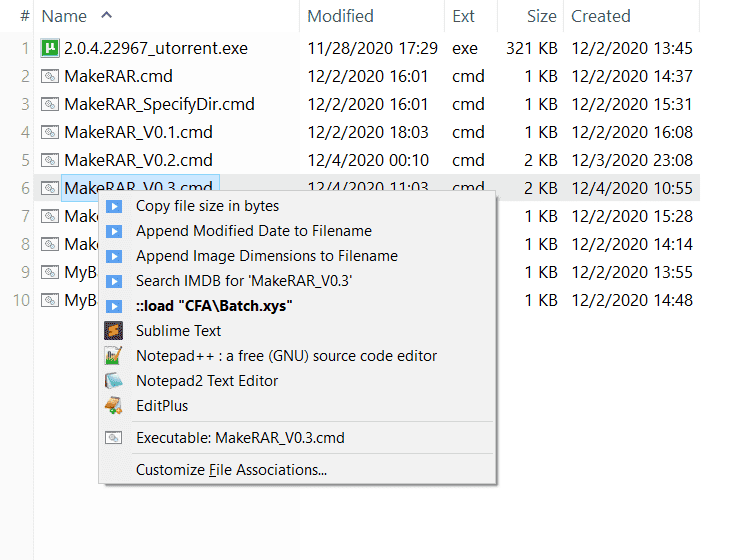

先选择"MakeRAR_V0.3.cmd"，然后"Ctrl+Alt+Enter"，最后选择想要的功能。

对比两种方式，明显CFA中使用Scripting比使用POM要快捷多，其脚本(CFA/Batch.xys)如下：

```
	$sublime_text_dir = "D:\PortableApps\Notepad\SublimeText_x64_3211";
	$npp_dir = "D:\PortableApps\Notepad\Npp_Portable";
	$choice = popupnested("Run batch|Open with | Sublime Text| Notepad++");
	end $choice == "";
	if($choice == "Run batch") {
		run "<curitem>";
	}
	elseif($choice == "Sublime Text") {
		run $sublime_text_dir."\subl "."""<curitem>""";
	}
	elseif($choice == "Notepad++") {
		run $npp_dir."\notepad++ "."""<curitem>""";
	}
```

CFA中设置如下：

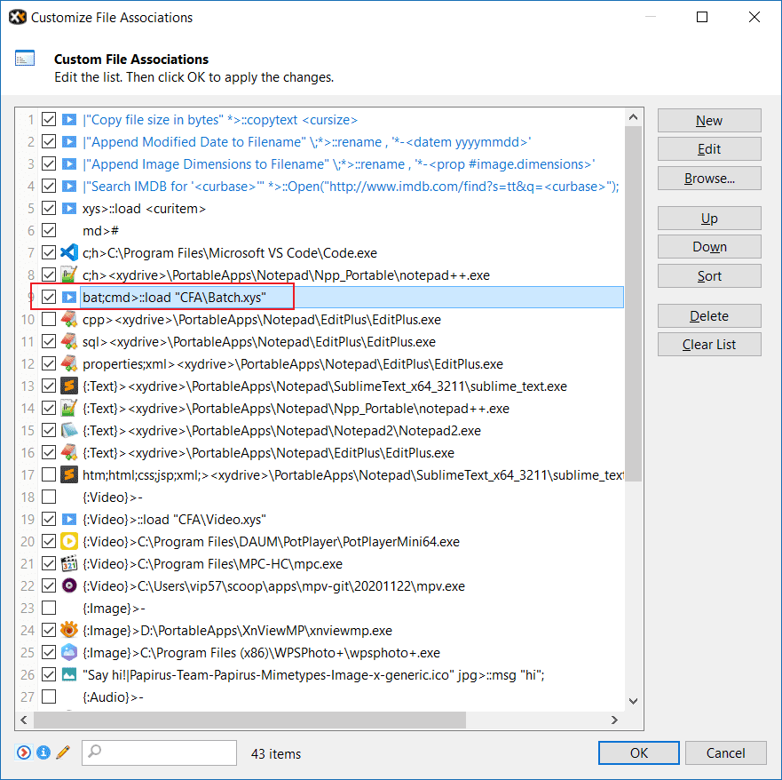

更多的例子及其示意图如下：

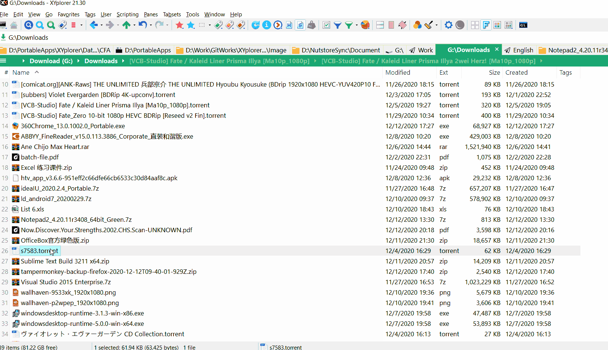

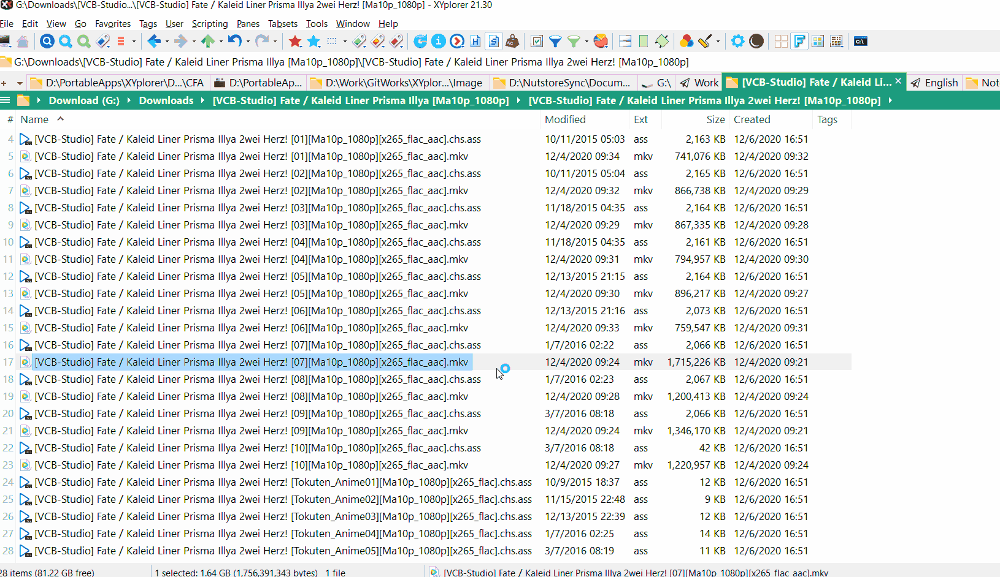

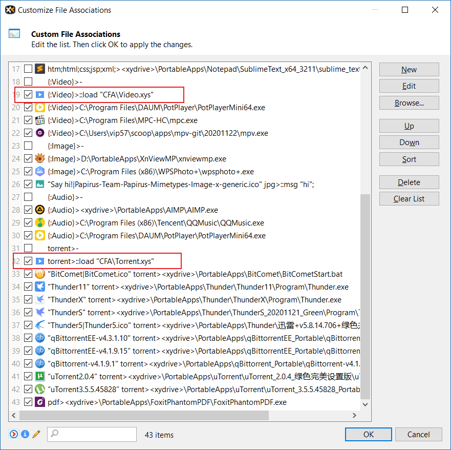

脚本如下:

CFA/Torrent.xys:

```
	$utorrent204_dir = "D:\PortableApps\uTorrent\uTorrent_2.0.4_绿色完美设置版";
	$utorrent35545828_dir = "D:\PortableApps\uTorrent\uTorrent_3.5.5.45828_Portable";
	$thunder11_dir = "D:\PortableApps\Thunder\Thunder11\Program";
	$thunderx_dir = "D:\PortableApps\Thunder\ThunderX\Program";
	$thunders_dir = "D:\PortableApps\Thunder\ThunderS_20201121_Green\Program";
	$thunder5_dir = "D:\PortableApps\Thunder\迅雷+v5.8.14.706+绿色共存版";
	$qbittorrent4191_dir = "D:\PortableApps\qBittorrent_Portable\qBittorrent-v4.1.9.1";
	$qbittorrentee41915_dir = "D:\PortableApps\qBittorrentEE_Portable\qBittorrentEE-v4.1.9.15";
	$qbittorrentee43110_dir = "D:\PortableApps\qBittorrentEE_Portable\qBittorrentEE-v4.3.1.10";
	$choice = popupnested("Open With: uTorrent| uTorrent_2.0.4| uTorrent_3.5.5.45828|Open With: Thunder| Thunder11| ThunderX| ThunderS| Thunder5|Open With: qBittorrent| qBittorrent-v4.1.9.1|Open With: qBittorrentEE| qBittorrentEE-v4.1.9.15| qBittorrentEE-v4.3.1.10");
	end $choice == "";
	switch($choice) {
		case "uTorrent_2.0.4":
			/* 
				Some characters of UTF-8 Unicode(65001) are found garbled. For example, the character '／'(not '/') is mistakenly interpreted as "￡ˉ".
			*/
			run("cmd /c start uTorrent.exe ".quote(<curitem>), $utorrent204_dir);
			break;
		case "uTorrent_3.5.5.45828":
			run("cmd /c start uTorrent.exe ".quote(<curitem>), $utorrent35545828_dir);
			break;
		case "Thunder11":
			// 如果查询到进程有迅雷运行时
			if(regexmatches(runret("cmd /c tasklist /v /fi ""IMAGENAME eq Thunder.exe"""), "Thunder") != "") {
				// 请保证你Thunder11目录包含"Thunder11"的关键字
				// 如果启动的是Thunder11
				if(regexmatches(runret("cmd /c tasklist /v /fi ""IMAGENAME eq DownloadSDKServer.exe"""), "Thunder11") != "") {
					run("cmd /c start Thunder.exe ".quote(<curitem>), $thunder11_dir);
				}
			} //否则重新启动Thunder11
			else {
				run("cmd /c start Thunder.exe ", $thunder11_dir);
				// 5000=5秒,请微调该时间直至Thunder11完全打开
				wait 5000;
				run("cmd /c start Thunder.exe ".quote(<curitem>), $thunder11_dir);	
			}
			break;
		case "ThunderX":
			run("cmd /c start Thunder.exe ".quote(<curitem>), $thunderx_dir);
			break;
		case "ThunderS":
			run("cmd /c start Thunder.exe ".quote(<curitem>), $thunders_dir);
			break;
		case "Thunder5":
			// 迅雷5打开后,在主界面手动打开种子
			run("cmd /c start 迅雷5.exe ".quote(<curitem>), $thunder5_dir);
			run("cmd /c start 迅雷L3.exe", $thunder5_dir);
			//run("explorer ".quote(<curpath>));
			break;
		case "qBittorrent-v4.1.9.1":
			run("cmd /c start qbittorrent.exe ".quote(<curitem>), $qbittorrent4191_dir);
			break;
		case "qBittorrentEE-v4.1.9.15":
			run("cmd /c start qbittorrent_x64.exe ".quote(<curitem>), $qbittorrentee41915_dir);
			break;
		case "qBittorrentEE-v4.3.1.10":
			run("cmd /c start qbittorrent_x64.exe ".quote(<curitem>), $qbittorrentee43110_dir);
			break;
		default:
			break;
	}
```

CFA/Video.xys:

```
	$potplayer_dir = "C:\Program Files\DAUM\PotPlayer";
	$mpc_dir = "C:\Program Files\MPC-HC";
	$mpv_dir = "C:\Users\vip57\scoop\apps\mpv-git\20201122";
	$choice = popupnested("Open With: Potplayer|Open With: MPC|Open With: MPV");
	end $choice == "";
	if($choice == "Open With: Potplayer") {
		run("cmd /c start PotPlayerMini64.exe ".quote(<curitem>), $potplayer_dir);
	}
	elseif($choice == "Open With: MPC") {
		run("cmd /c start mpc.exe ".quote(<curitem>), $mpc_dir, 866);
	}
	elseif($choice == "Open With: MPV") {
		run("cmd /c start mpv.exe ".quote(<curitem>), $mpv_dir, 866);
	}
```


# POM使用案例

下面会用一个案例进行讲解。比如广大蓝光大佬，XXX资源分享大佬，亦或者是广大热爱收藏蓝光或者各种基于蓝光的经视频处理技术后重新编码的各种rip都需要用到BT下载器。PT网站要求不一，对BT下载器的版本要求不一，所以下载某些资源都需要切换版本。


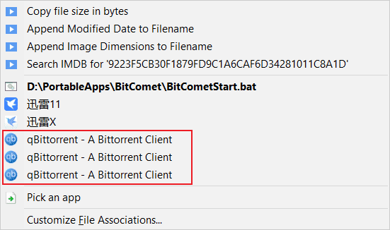

根本无法辨别qBittorrent版本，这时候就需要修改POM"打开方式"菜单中某项的标题

修改内容如下：

其中`"`是在输入法英文下打出来的双引号。

```
"qBittorrentEE-v4.3.1.10" torrent>D:\PortableApps\qBittorrentEE_Portable\qBittorrentEE-v4.3.1.10\qbittorrent_x64.exe
"qBittorrentEE-v4.1.9.15" torrent>D:\PortableApps\qBittorrentEE_Portable\qBittorrentEE-v4.1.9.15\qbittorrent_x64.exe
"qBittorrent-v4.1.9.1" torrent>D:\PortableApps\qBittorrent_Portable\qBittorrent-v4.1.9.1\qbittorrent.exe
```

这时就可以区分qBittorrent各个版本了：

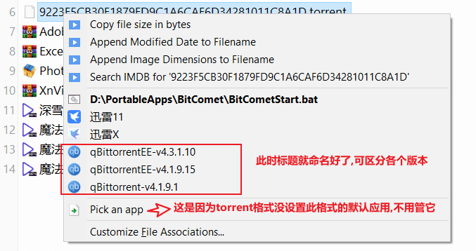


### 定制图标

可以看到我的BitComet使用的是bat运行，因为我运行BitComet需要打开磁盘提速服务，因此我写了个脚本，在开启前打开词服务再启动BitComet。我想把这个bat的图标修改为BitComet的图标。

图标使用IcoFX3进行提取并命名为BitComet.ico并放置\<xyicons\>。接下来进行修改：

由于我的图标放在\<xyicons\>中，我不需要书写成绝对路径的形式：

```
"BitComet|D:\PortableApps\XYplorer\Data\Icons\BitComet.ico" torrent>D:\PortableApps\BitComet\BitCometStart.bat
```

而是：

```
"BitComet|BitComet.ico" torrent>D:\PortableApps\BitComet\BitCometStart.bat
```

注意管道符`|`两边的内容不要有空格，特别是管道符右边，要紧接着内容，不要加空格！！！

这样就完成了修改了，效果如下：

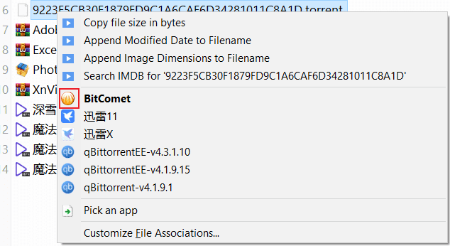

### 定制分割线

语法格式：

```
格式名>-
```

为各个BT工具加分割线，如图所示：

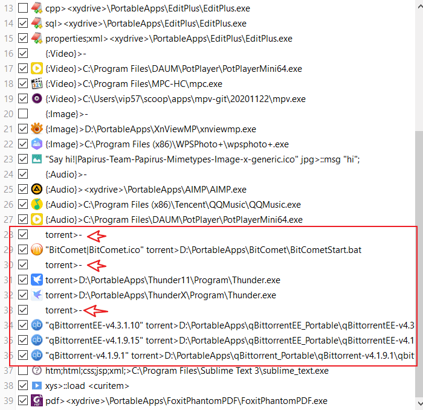

效果图如下：

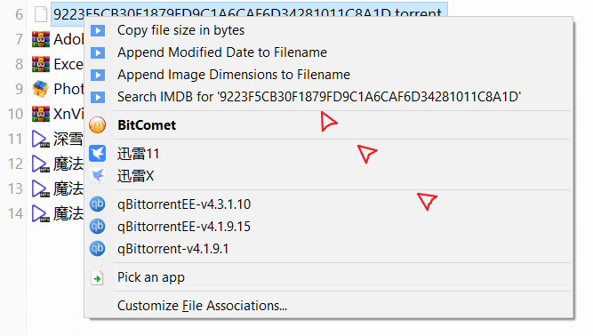


发挥你们的想象力吧，这个功能的应用场景太多了。比如有些图片文件需要用PS打开，平时浏览图片却不用；有些音乐需要倍速播放，所有需要切换音频播放器，有时候则不用；视频同理；有些PDF需要识别OCR，需要使用ABBYY，有些时候用其他PDF软件；有些office文档需要用WPS打开，有些则用Microsoft Office打开；...

有了POM功能，你只需要用对应软件，推荐软件尽量选择便携版；绿色版有时候不是一个很好的选择，因为部分应用需要使用bat进行注册相关服务等才可使用；安装版只局限了当前宿主系统。因此要区分Portable, Green, Setup。

