# <span id="xyplorer_search">XY所有搜索功能</span>

使用`List All Commands...`命令，通过键盘依次按下Alt->H->O呼出，然后输入关键词find，得到相关的命令如下：

```
# 260	Edit | Find Files...	 (Ctrl+F)
# 261	Edit | Find Now	 (Ctrl+Alt+F)
# 615	Tools | List Management | Find Files: Name...
# 616	Tools | List Management | Find Files: Location...
# 617	Tools | List Management | Find Files: Excluded Items...
# 1058	Miscellaneous | Select Info Panel Tab | Find Files	 (Ctrl+7)
# 1026	Miscellaneous | Find Files | Open Find Files and Reset	 (Ctrl+Shift+F)
# 1030	Miscellaneous | Find Files | Search All Tabs
```

继续输入关键词search，其中与搜索有关的命令有：

```
# 262	Edit | Repeat Last Search
# 266	Edit | Quick Search...	 (F3)
# 268	Edit | Toggle Quick Search	 (Ctrl+Shift+F3)
# 267	Edit | Repeat Last Quick Search	 (Shift+F3)
# 638	Tools | List Management | Quick Search...
# 1030	Miscellaneous | Find Files | Search All Tabs
```

继续输入关键词Live Filter Box，其中与搜索有关的命令有：

```
# 675	Window | Show Live Filter Box	 (Alt+F3)
# 694	Window | Arrangement | Live Filter Box in Status Bar
# 1080	Miscellaneous | Focus Functions | Focus Live Filter Box	 (Ctrl+Alt+X)
```

注意：使用`List All Commands...`命令搜索到的命令项目通过鼠标左键双击可以启动命令。

使用`Customize Toolbar...`命令，通过键盘依次按下Alt->T->B呼出，然后在左侧或右侧的搜索框输入关键词组Find by，得到相关的工具栏有：

```
Find by Tags
Find by Label
```

这两个按钮是特有的搜索关于Label(标签)和Tags(标注)的内容的按钮。

XYplorer的搜索<u>主要体现</u>在四处: **Find Files**，**Quick Search**，**Live Filter Box**，**文件列表关键词匹配**。


# 查找文件(Find Files)

1.`Edit->Find Files(Ctrl +F)`

需要指定搜索目录，关键字。其他过滤条件可选。但搜索速度慢，长时间运行可能会很卡。

什么是Find Files Tab？如下图所示：

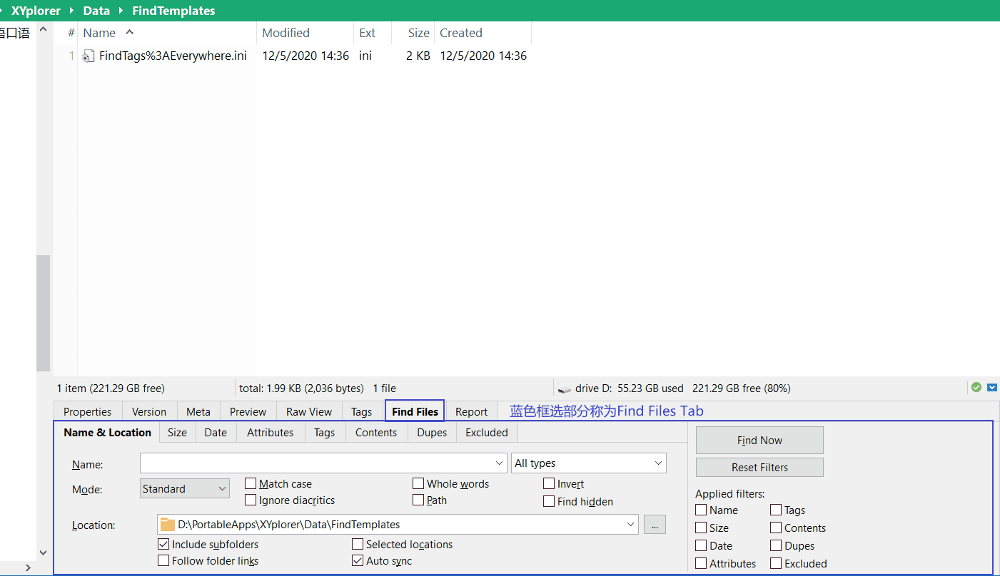

Find Files Tab可以通过<kbd>Ctrl+F</kbd>呼出，也可通过在键盘依次按下Alt->E->F呼出。


Find Files Tab使用帮助，地址栏输入：

```
rtfm "idh_find.htm";
```

了解了Find Files Tab后，我们可以开始讲解Search Template了。

## 搜索模板(Search Template)

### 介绍

首先，Template在XY语境中应该翻译为“模板”。那么Search Template就是用于Find Files Tab中搜索功能的一个模板。

那么Search Template保存的是什么呢？我们看Find Files Tab那张图片，可以看到有许多选项卡，比如Name & Location, Size, Date, Attributes, Tag, Contents, Dupes, Exclude。每个选项卡都是有参数可以勾选的，而这些参数都保存Search Template中。

### 保存

Search Template保存

如下图所示，这些勾选和添加的参数我都想要保存起来，并且会经常使用这些参数，我想要将其参数保存到Search Template中，下次打开Find Files Tab后，我可以很快地加载这些参数，而不用一个一个地设置它们。

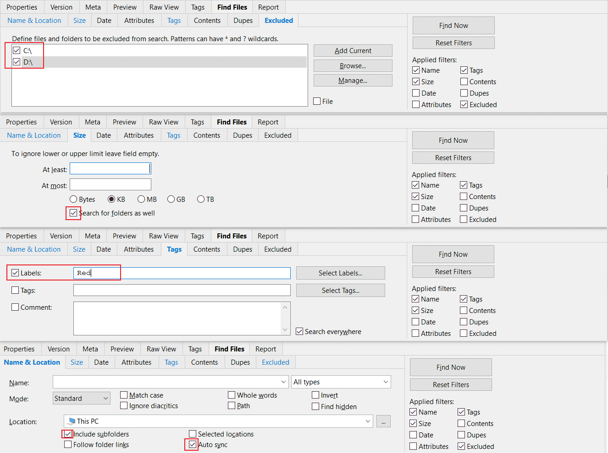

那么我该如何保存？

Search Template命令在菜单栏Edit->Search Templates...中，可以通过按键依次按下Alt->E->A呼出。

如下图所示为Search Template的界面：

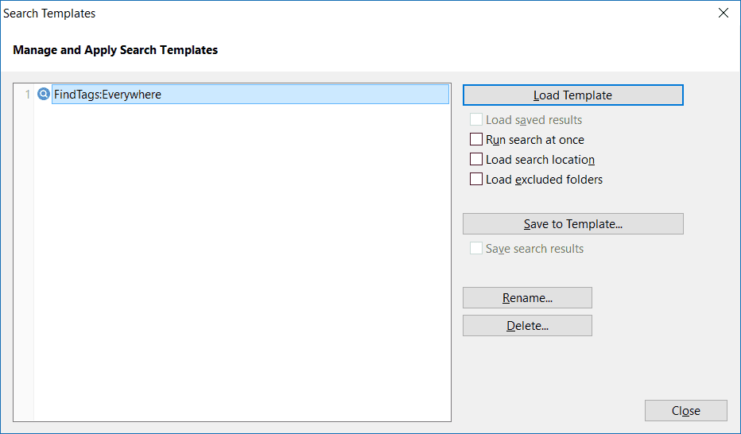

呼出Search Template界面后，点击Save to Template...：

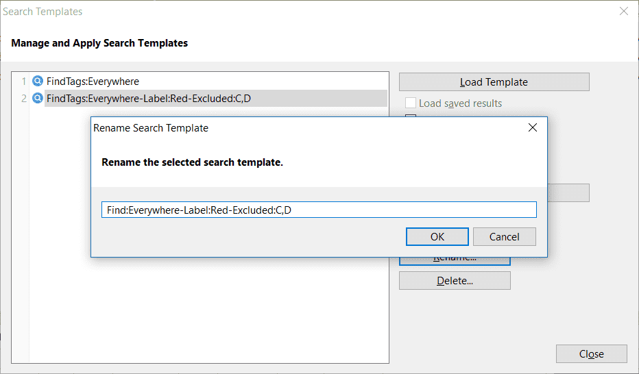

这里我命名为Find:Everywhere-Label:Red-Excluded:C,D。

### 载入

Search Template的载入

好了，我们点击Find Files Tab中的"Reset Filters"，如下图所示：


这样"Reset Filters"按钮下方的Applied filters条件参数全部清空。

现在该如何加载每个选项卡的参数呢？

同样，我们先通过按键依次按下Alt->E->A呼出Search Template界面，然后选中对应的Search Template后点击"Load Template"按钮：

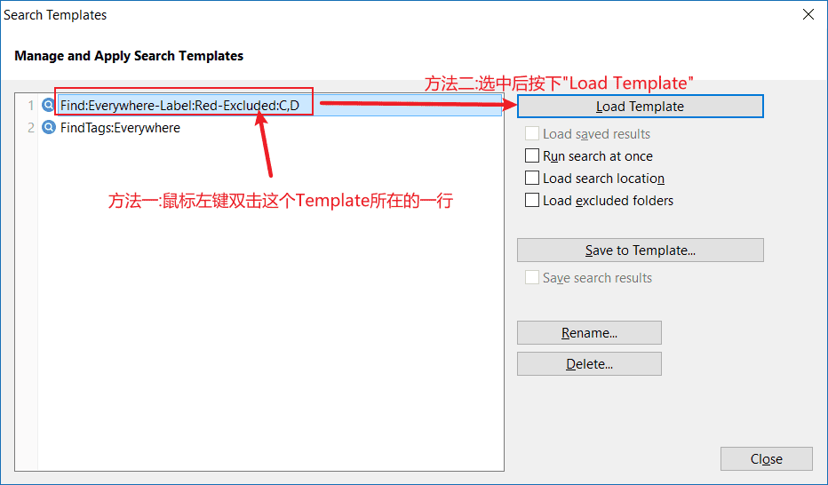

这样就可以看到Find Files Tab加载了各个选项卡的参数了。

## Find Files Tab的使用

Find Files Tab通过<kbd>Ctrl + F</kbd>呼出。为了得到想要的结果，需要给出匹配条件，Find Files Tab提供丰富的匹配条件（过滤条件），XY对这些匹配条件进行了分类，可分为8个子选项卡，每个子选项卡的参数设置后不会生效，想要使之生效，需要在”Applied filters”勾选对应子选项卡名。

子选项卡和"Applied filters"的对应关系如下图所示：


Find Files Tab共有8个子选项卡，每个选项卡参数设置后，为了使这些选项卡参数都生效，需要勾选对应的"Applied filters"，确认好搜索条件后，可以点击"Find Now"进行搜索。


# 快速搜索(Quick Search)

`Edit->Quick Search(F3)`

功能很强大。需要结合匹配规则进行搜索，详细使用说明请在地址栏输入:

```
rtfm "idh_quicknamesearch.htm";
```

我写过的一个简易版按Tag搜索脚本就是参考以上内容才写出来的。

# 实时过滤器(Live Filter Box)

使用方式：`Window->Show Live Filter Box`。在地址栏最右侧可以看到，如图


<kbd>Ctrl + Alt + X</kbd>进入，搜索关键字。

该功能用于当前目录下筛选文件（极其适合目录文件过量的情况下进行筛选）

假设我们需要筛选出<code>C:\Windows\SysWOW64\certcli.dll</code>，你只知道关键字"cert"，在Live Filter Box键入"cert"后，

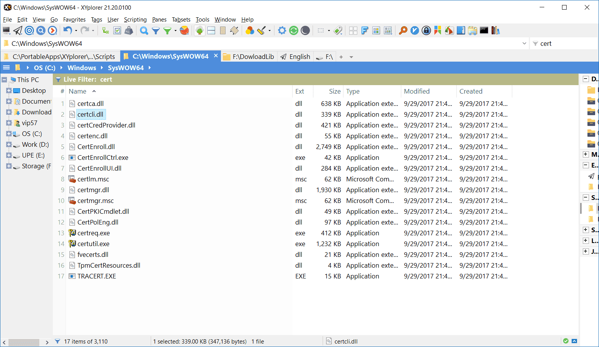

这是一次模拟筛选，该功能场景范围过窄但好用。

# 文件列表视窗中的关键词匹配

在浏览文件列表时，输入要匹配文件名关键词（必须从目标文件名的首位字母开始输入）可以快速查找文件，使用效果图如下：

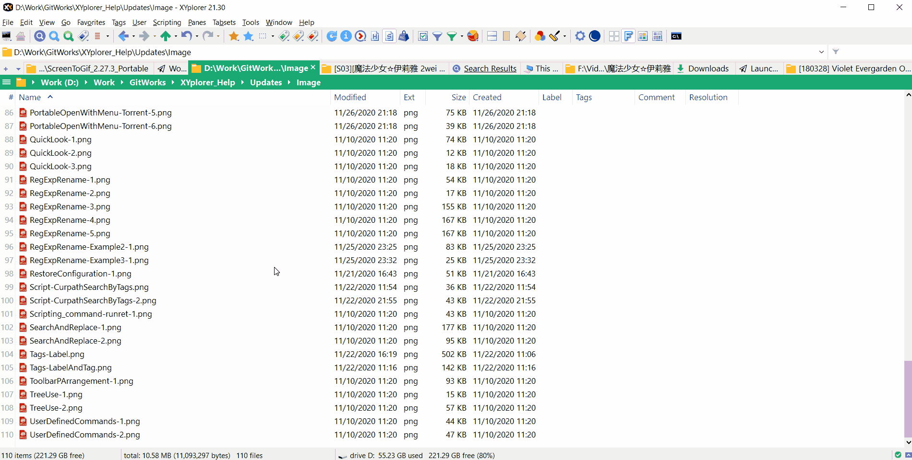


# Everything与XYplorer联动

## Everything内容打开到XYplorer侧

`Options->General->Context Menu`，如图

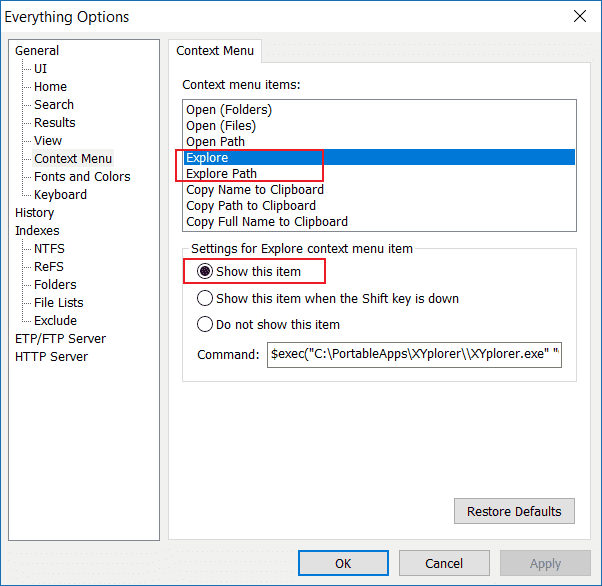

Explore:

```
$exec("你的XYplorer目录\XYplorer.exe" "%1")
```

Explore Path:

```
$exec("你的XYplorer目录\XYplorer.exe" /select="%1")
```

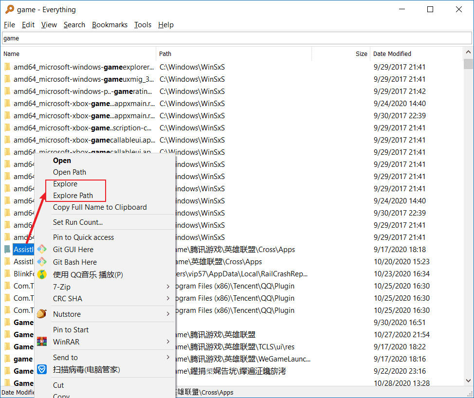

Explore和Explorer Path的区别：前者打开这个文件；后者打开这个文件所在的父目录。

参考：[Everything and XYplorer - My Everything Integration Settings - XYplorer Beta Club](https://www.xyplorer.com/xyfc/viewtopic.php?t=20506)

这里有个以前用过目前弃用的Scripts的链接：[Everything for xyplorer - XYplorer Beta Club](https://www.xyplorer.com/xyfc/viewtopic.php?f=7&t=21480)。如果你感兴趣，可以尝试一下。

当然，纠结Scripts文件来调用`Everything's command-line ES`服务来搜索是没有必要的，复杂麻烦而且没直接使用Everything来得快。你可以跟我一样，添加一个Everything按钮，或者设置一个热键调用XY（请参考[XYplorer间接调用Everything](#invoke_everything)）。

## <span id="invoke_everything">XYplorer间接调用Everything</span>

仅在当前目录下搜索（搜索的目标包括当前目录和当前目录的所有子目录)，示意图如下，

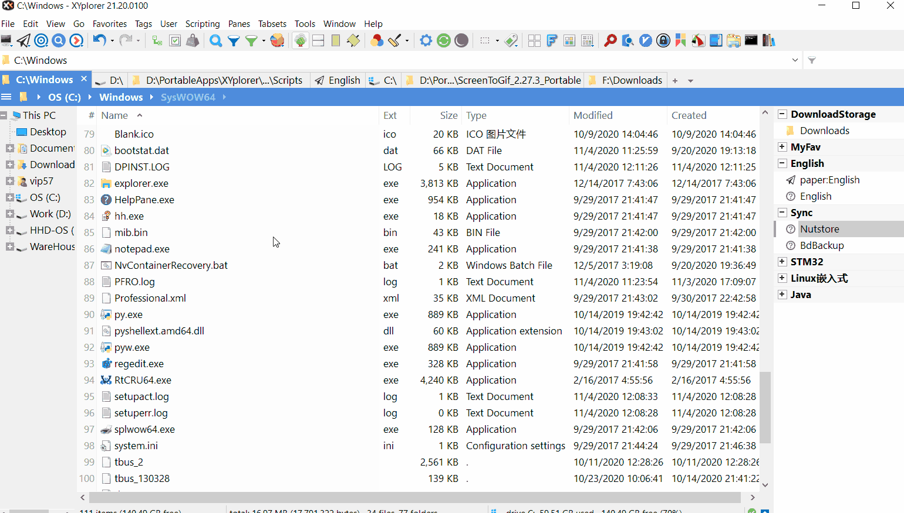

具体显示步骤如下，

1.创建脚本文件。菜单栏`Scripting->Go to Scripts Folder`来到\<xyscripts\>的目录下，创建名为`EverythingCurpathSearch.xys`脚本文件，内容如下，记得修改everything目录

版本一[可选，推荐]

```
	$everything = "D:\PortableApps\Everything\everything.exe";		//填写everything.exe路径
	runret ("cmd /c ".$everything." -path "."""<curpath>""");
```

以上每行语句都有一个<kbd>Tab</kbd>哦。

版本二[可选]

版本二特别注意：<span style="color:red">**搜索的关键词首尾不能分别带有"。也就是没办法进行准确搜索**</span>。比如`"Common Files"`

```
	$everything = "D:\PortableApps\Everything\everything.exe";		//填写everything.exe路径
	$args = input("当前文件下搜索,请输入关键词:");
	runret ("cmd /c ".$everything." -path "."""<curpath>"""." -s "."""$args""");
```

2.绑定热键。菜单栏`User->Manage Commands...(Ctril + Alt + F9)`

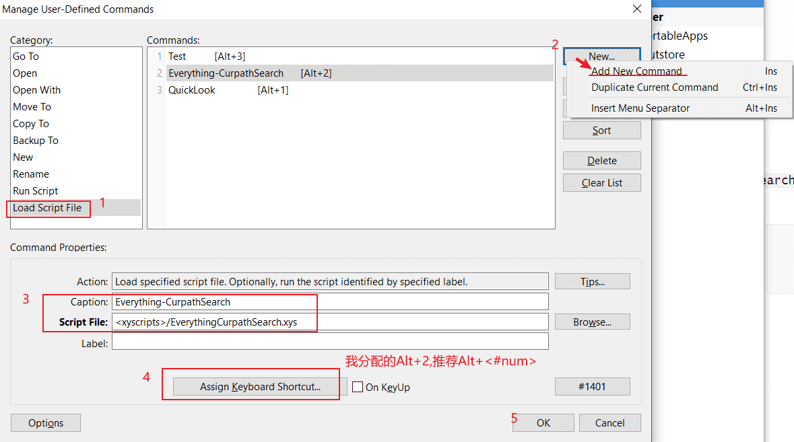

```
Cpation:CurpathSearch
Script Files:<xyscripts>/EverythingCurpathSearch.xys
```

这样就设置完成了。开始使用吧，在XYplorer当前Tab所在当前目录下按<kbd>Alt+2</kbd>，键入你想要搜索的key words，然后<kbd>Enter</kbd>即可。

Script编写思路：通过命令行调用everything，everything想要完成当前目录搜索，需要知道主程序的外部接口[[?](https://www.voidtools.com/support/everything/command_line_options/)]，需要获取当前目录和用户键入值。

Script中runret()可参考`XYplorer.chm`

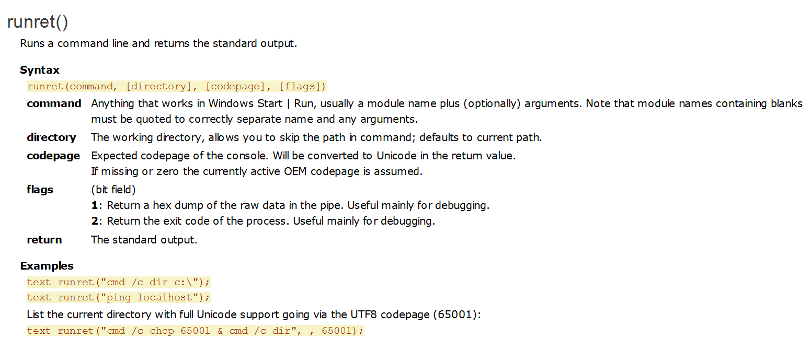

编写的脚本很简陋，其目的是为了打开Everything，并自动化地添加上当前目录。

如果有兴趣的同学们可以自行研究下XYplorer-Scripting.md和XYplorer-ScriptingNote.md，熟悉流程控制语句和常用的Script Command就可以进行更高逻辑的功能实现了。

# Search Template进阶

Search Template详细使用说明请在地址栏输入：

```
rtfm "idh_searchtemplates.htm";
```

## XY如何保存含有特殊符号的Search Template

Search Template是一个模板，模板文件保存在\<xydata\>\FindTemplates中。

Template创建时，需要为当前Template进行命名，命名后进行保存，保存的文件名称与Template的一致，但由于Windows将如下字符作为保留字符：

>The following reserved characters:
>
>- < (less than)
>- \> (greater than)
>- : (colon)
>- " (double quote)
>- / (forward slash)
>- \ (backslash)
>- | (vertical bar or pipe)
>- ? (question mark)
>- \* (asterisk)
>
>关于Windows命名规范详情可参考[Naming Files, Paths, and Namespaces - Win32 apps | Microsoft Docs](https://docs.microsoft.com/en-us/windows/win32/fileio/naming-a-file?redirectedfrom=MSDN)，以上引用内容为保留字符的描述。

所以文件名就不应该出现这些保留字符，不然就会出现文件名非法的情况。然而XY允许使用这些被Windows作为保留字符的字符。为了避免Windows文件名非法，XY采用了"% & Hex(charcode)"的方案来转换这些字符。

在地址栏输入:\<xydata\>\FindTemplates,看到我保存的Search Template文件:

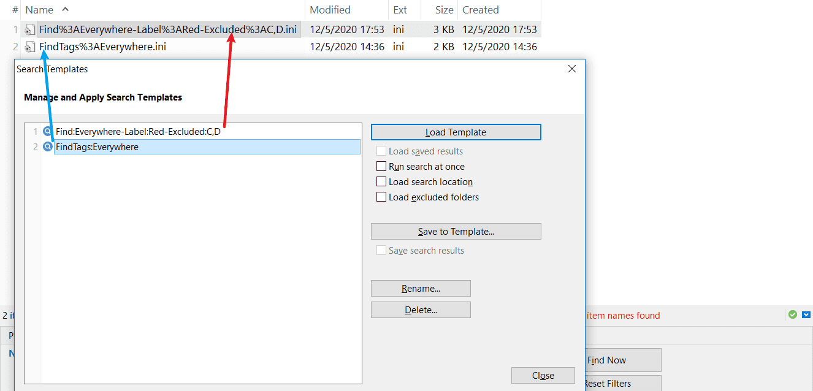

可以发现':'被解释成"%3A"了。Windows保留字符的对于的十六进制数如下：

```c
/* 以下为十六进制数 */
< // 3D
> // 3E
: // 3A
" // 22
/ // 2F
\ // 5C
| // 7C
? // 3F
* // 2A
```

给出对应ASCII表


## Search Template快速载入

每次载入都需要点击菜单栏"Edit->Search Templates..."然后选择模板文件，再载入，这样速度太慢了。于是参考了[load search template and open search box directly - XYplorer Beta Club](https://www.xyplorer.com/xyfc/viewtopic.php?t=11958)的脚本，其脚本如下：

```
    $template = popupmenu(replace(listfolder("<xydata>\FindTemplates", "*.ini", 4), ".ini"));
    loadsearch $template, "x";
    # 260;
```

各位可以试着复制上面的内容，然后在菜单栏"Scripting->Run Scripting..."呼出Run Scripting...，也可以通过键盘依次按下Alt->S->R呼出。把复制的脚本内容粘贴，然后运行这个脚本（前提是你有保存Search Template文件哦）。

这个脚本受限于"loadsearch"函数，该函数不支持载入包含对Windows保留字符进行编码的文件名，所以我在上面脚本基础上进行修改，将编码的保留字符还原为ASCII字符，修改好后的脚本如下：

```javascript
	// Get the base filename of user-selected template file
	$template = popupmenu(replace(listfolder("<xydata>\FindTemplates", "*.ini", 4), ".ini"));	
	// If $template is "", then terminate the running script, and else nothing be done.
	end $template == "";
	$invalid_characters = "<,>,:,/,\,|,?,|,*"; // a filename that doesn’t contain any control characters or these characters as follows
	$invalid_characters_ctr = 9;
	$searchlist =;
	$ctr = 1;
	// Get searchlist of invalid_characters which use for replacelist function.
	foreach($token, $invalid_characters, ",") {
		if ($ctr < $invalid_characters_ctr) {
			$temp = '%'.dectohex(asc($token)).',';
		} else {
			$temp = '%'.dectohex(asc($token));
		}
		$ctr += 1;
		$searchlist .= $temp;
	}
	loadsearch replacelist($template, $searchlist, $invalid_characters, ",", 0, 0), x; //Load specified search template ini file
	# 260;	// This Command ID will invoke Find Files Tab
```

可以把脚本文件命名FastLoadSearchTemplate.xys，然后保存在\<xyscripts\>中，然后通过按键依次按下Alt->U-M呼出"Manager User-Defined Commands"，设置快捷键为<kbd>Shift+T</kbd>

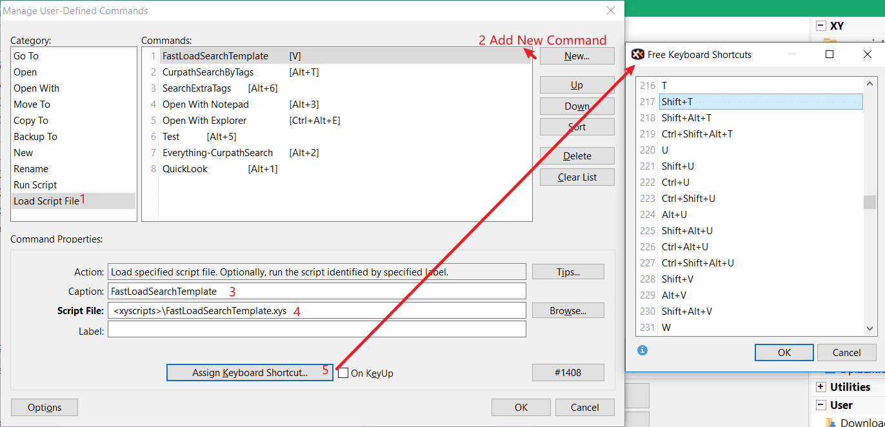

使用效果如下：

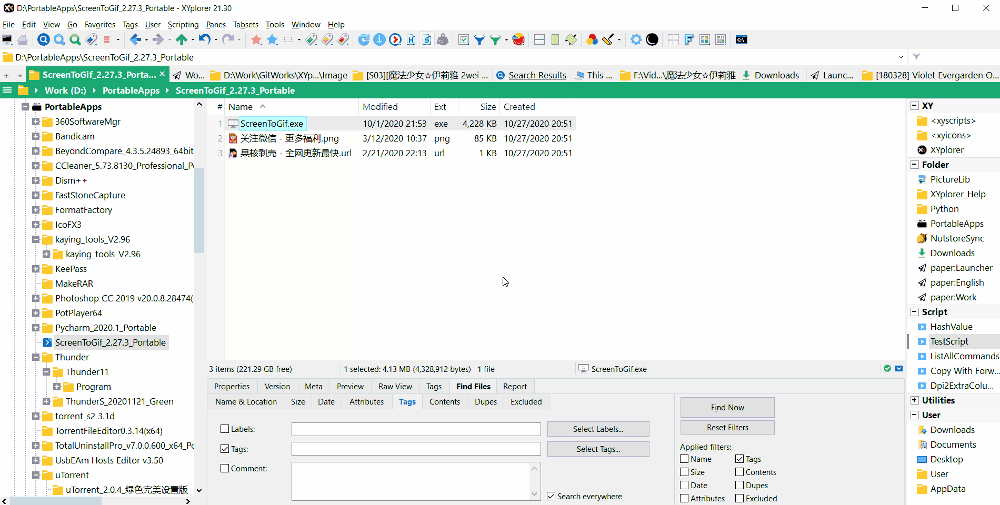

